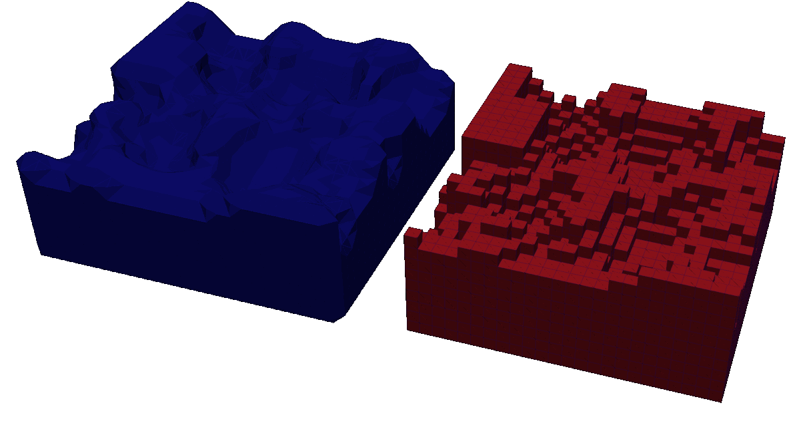

<p align="center">
  
</p>

-----

# ISTHMUS Ablation Core

[](LICENSE)
[](CMakeLists.txt)
[](docs/development/build-and-link.md)

`isthmus-ablation-core` is a voxel-resolved solid ablation framework for
simulations where a material changes shape because gas-surface reactions, heat
fluxes, or prescribed recession rates remove solid mass.

The code treats the solid as a mass-bearing voxel ledger. Each voxel stores a
material, density, volume, remaining mass, and active/deleted state. Surface
fluxes can be applied directly to voxel faces or mapped through an ISTHMUS
triangle mesh, then carried back into the solid with conservative policies such
as normal-directed carryover. This makes it possible to model recession of
curved, rough, or image-derived samples without pretending the voxel stair-step
surface is the physical interface.

The main coupled workflow is simple: reconstruct a surface from a voxel solid,
let DSMC/SPARTA compute particle-surface chemistry and mass flux, remove the
corresponding solid mass, delete depleted voxels, rebuild the surface, and
repeat through physical time.

Manual PDF: [docs/isthmus-ablation-core-manual.pdf](docs/isthmus-ablation-core-manual.pdf)

## Table Of Contents

- [What It Does](#what-it-does)
- [Why It Exists](#why-it-exists)
- [Coupled Workflow](#coupled-workflow)
- [Input Style](#input-style)
- [Modes](#modes)
- [Requirements](#requirements)
- [Quick Start](#quick-start)
- [Standalone Mode](#standalone-mode)
- [Examples](#examples)
- [Documentation](#documentation)
- [Paths](#paths)

## More

- [ISTHMUS native library](https://github.com/ctfl-public/isthmus)
- [SPARTA DSMC code](https://github.com/sparta/sparta)
- [HERMES microstructure workflow](https://github.com/ctfl-public/hermes)
- [Manual PDF](docs/isthmus-ablation-core-manual.pdf)
- [Getting started](docs/getting-started.md)
- [Command reference](docs/commands/index.md)
- [Examples](docs/examples/pregen-tiff-carbon-recession.md)
- [MCC array-sweep example](examples/mcc-carbon-array-sweep/README.md)

## What It Does

- Evolves voxelized solids under surface-driven mass loss.
- Uses ISTHMUS to bridge voxel solids and triangle surface meshes.
- Couples directly to [SPARTA](https://github.com/sparta/sparta) for rarefied
  gas chemistry, surface reactions, and MPI particle transport.
- Reads SPARTA-style command files so standalone and DSMC-hosted cases share a
  familiar input language.
- Supports standalone verification cases with prescribed fluxes and exact
  expectations.
- Runs TIFF-derived carbon recession cases, including converged DSMC mass-flux
  loops.
- Writes history tables, VTK voxel/surface dumps, and regression-test outputs.

## Why It Exists

Ablating materials do not just lose mass. They change the geometry seen by the
gas. For porous or rough carbon-like solids, that moving boundary is the
problem. This repository supplies the solid-state memory and surface/voxel
coupling needed to let DSMC drive geometry change in a controlled, testable way.

## Coupled Workflow

1. Create or import a voxelized solid, such as a sphere, slab, or TIFF scan.
2. Use ISTHMUS to reconstruct a surface and map triangles to owning voxels.
3. Run DSMC/SPARTA around that surface, or apply a standalone prescribed flux.
4. Convert surface collisions, reactions, or imposed fluxes into removed solid
   mass.
5. Delete depleted voxels, update the voxel mass state, and rebuild the surface.
6. Repeat until the requested physical ablation time or recession state is
   reached.

## Input Style

Cases are written as compact command files modeled after
[SPARTA](https://github.com/sparta/sparta) input scripts. The same file can mix
native SPARTA commands such as `create_grid`, `species`, `mixture`,
`create_particles`, `fix`, and `run` with IAC commands such as `voxel_create`,
`isthmus_surface`, `surf_flux`, `voxel_ablate`, and `iac_run`.

This keeps coupled workflows readable for SPARTA users while adding the
solid-state commands needed for evolving voxel geometries. See the
[language overview](docs/commands/language.md), [voxel commands](docs/commands/voxel.md),
[surface commands](docs/commands/surface.md), and
[grid/fluid output commands](docs/commands/grid-write-vtu.md) for the command
families.

## Modes

In standalone mode, `ia-core` runs lightweight SPARTA-style input files with no
gas domain. This is ideal for testing voxel recession, ISTHMUS mapping, TIFF
import, carryover policies, and exact solutions.

In DSMC-hosted mode, the same core library is compiled into a private
DSMC/SPARTA overlay. The build links IAC directly into
[SPARTA](https://github.com/sparta/sparta), so SPARTA owns particles,
collisions, chemistry, MPI, and surface tallies while this repository owns the
evolving voxel solid.

## Requirements

Normal builds and coupled DSMC/IAC runs do not require Python.

For all builds:

- A C++20 compiler.
- CMake and `make`.
- [ISTHMUS](https://github.com/ctfl-public/isthmus), the surface
  reconstruction library used by IAC workflows.

For standalone `ia-core` builds:

- ISTHMUS is required for the supported standalone examples and tests that
  reconstruct or use triangle surfaces.
- Narrow direct-voxel developer cases can build without ISTHMUS, but that is
  not the recommended setup.

For DSMC/SPARTA-coupled builds:

- A [SPARTA DSMC](https://github.com/sparta/sparta) checkout.
- An ISTHMUS checkout or install.
- A DSMC machine target supported by that checkout, such as `mpi`, `mac_mpi`,
  or `serial`.
- The DSMC checkout must include the direct reaction mass-flux computes:

```text
src/compute_react_surf_mass_flux.{h,cpp}
src/compute_react_boundary_mass_flux.{h,cpp}
```

Python is optional. It is only used for helper targets that generate TIFF
fixtures for TIFF import tests, plus documentation or report-generation tools.
Those helpers use only the Python standard library; Python 3.6 or newer is
intended to be enough for the generated TIFF fixture tests.

## Quick Start

Clone or install the external codes first:

```bash
git clone https://github.com/ctfl-public/isthmus.git $HOME/isthmus
git clone https://github.com/sparta/sparta.git $HOME/dsmc
```

Build the native ISTHMUS C++ library:

```bash
cmake -S $HOME/isthmus -B $HOME/isthmus/build
cmake --build $HOME/isthmus/build -j
```

Then set the roots for the current shell:

```bash
export DSMC_ROOT=$HOME/dsmc
export ISTHMUS_ROOT=$HOME/isthmus
```

To make those paths persistent, add the same exports to your shell startup
file, such as `~/.bashrc`, `~/.bash_profile`, or `~/.zshrc`.

Then build the private DSMC/IAC executable:

```bash
make mpi
make test-dsmc
```

DSMC-linked builds require a DSMC checkout that includes the direct reaction
mass-flux computes:

```text
src/compute_react_surf_mass_flux.{h,cpp}
src/compute_react_boundary_mass_flux.{h,cpp}
```

Configure fails with a clear error if those files are missing. Standalone
`ia-core` builds do not require DSMC.

The top-level `make` targets wrap CMake configuration and DSMC's own machine
targets:

```bash
make mpi
make mac_mpi
make serial
make dsmc DSMC_MACHINE=<machine>
```

The coupled executable is:

```text
build-dsmc/bin/dsmc-iac
```

`dsmc-iac` is a compiled launcher, not a Python script. Normal DSMC/IAC builds
and coupled runs do not require Python. Python is only used by optional helper
targets such as generated TIFF fixture tests, documentation, and report
generation.

Run a coupled example:

```bash
build-dsmc/bin/dsmc-iac \
  -in examples/pregen-tiff-carbon-recession/in.dsmc-co-converge
```

This build does not edit your DSMC checkout. It creates a disposable overlay in
`build-dsmc/dsmc-overlay/` where DSMC source files and IAC bridge commands are
symlinked together.

For more setup detail, see the full [getting started guide](docs/getting-started.md)
and [build/link guide](docs/development/build-and-link.md).

## Standalone Mode

```bash
make standalone
make test-standalone
```

Run:

```bash
./build/ia-core -in examples/slab-direct-ablation/in.slab-direct-ablation
```

## Examples

- [Pregen TIFF carbon recession](docs/examples/pregen-tiff-carbon-recession.md)
- [DSMC sphere kinetic theory](docs/examples/dsmc-sphere-kinetic.md)
- [DSMC mass-flux coupling](docs/examples/dsmc-sphere-mass-flux.md)
- [Slab direct ablation](docs/examples/slab-direct.md)
- [Slab ISTHMUS ablation](docs/examples/slab-isthmus.md)
- [Sphere ISTHMUS ablation](docs/examples/sphere-isthmus.md)
- [TIFF sphere recession](docs/examples/tiff-sphere.md)

## Documentation

- [Documentation index](docs/index.md)
- [Manual PDF](docs/isthmus-ablation-core-manual.pdf)
- [Getting started](docs/getting-started.md)
- [Build and link guide](docs/development/build-and-link.md)
- [Architecture concept](docs/concepts/architecture.md)
- [Verification concept](docs/concepts/verification.md)
- [Code architecture](docs/development/code-architecture.md)
- [Directory layout](docs/development/directory-layout.md)
- [Testing](docs/development/testing.md)
- [Command reference](docs/commands/index.md)
- [Editor integration](editors/README.md)
- [MCC carbon array sweep](examples/mcc-carbon-array-sweep/README.md)

Useful command pages:

- [Language overview](docs/commands/language.md)
- [Voxel commands](docs/commands/voxel.md)
- [Voxel ablation](docs/commands/voxel-ablate.md)
- [Voxel dumps](docs/commands/voxel-dump.md)
- [Surface and flux commands](docs/commands/surface.md)
- [ISTHMUS surface reconstruction](docs/commands/isthmus-surface.md)
- [Grid/fluid VTU output](docs/commands/grid-write-vtu.md)
- [Looping and control flow](docs/commands/loops.md)
- [Verification commands](docs/commands/verify.md)

## Paths

You can pass roots directly:

```bash
make mpi DSMC_ROOT=/path/to/dsmc ISTHMUS_ROOT=/path/to/isthmus
```

The default DSMC machine target is `mpi`. Override it with:

```bash
make dsmc DSMC_MACHINE=mac_mpi
```
