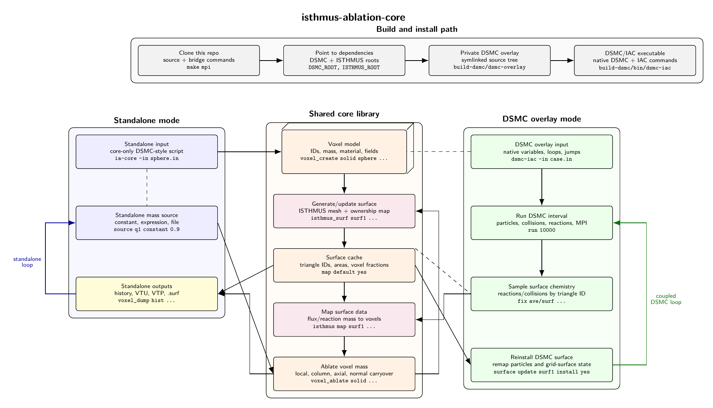

# Architecture

The project has two intended front doors into one shared core:

- Standalone mode: this repository owns parsing, timestep advancement, stats,
  dumps, and verification.
- DSMC/SPARTA-linked mode: DSMC/SPARTA owns the main input parser and timestep
  loop, while this project contributes commands, computes, and a core library
  object.

The shared core owns:

- voxel state with stable IDs;
- material density and voxel mass;
- generated and imported geometries;
- mass-loss sources;
- ablation policies;
- diagnostics and history;
- ISTHMUS surface state and ownership mapping.

The current flowchart is available here:



[Architecture flowchart](../architecture_flowchart.pdf)

## ISTHMUS Coupling

The current standalone ISTHMUS path is:

1. Convert active voxels to an `isthmus::VoxelSet`.
2. Call `isthmus::MarchingWindows`.
3. Cache the surface mesh and triangle-to-voxel ownership fractions.
4. Run `surf_flux ...` to apply mass flux to selected triangles.
5. Run `voxel_ablate ...` to update voxel mass and delete empty voxels.
6. Run `isthmus_surface ...` again if the voxel state changed.

## Future DSMC/SPARTA Coupling

The planned DSMC coupling should support both a command-loop path and a
iac_timestep-callback path. We will implement whichever proves easiest first.

The command-loop path would look like:

```text
label ablate-loop
run 10000
surf_flux surf1 source dsmc-flux select all
voxel_ablate solid surface surf1 policy local delete yes
isthmus_surface surf1 voxels solid
surface update surf1 install yes
jump SELF ablate-loop
```

The loop keeps DSMC/SPARTA in charge of particles, reactions, variables, labels,
jumps, MPI, and stats. This project supplies commands that operate on the
shared voxel/surface core between DSMC run intervals.

The callback path would expose similar core operations through a fix-style or
other timestep callback so geometry can update during a longer run. That may be
more natural for cases that need frequent ablation updates.

The main tradeoff is timing control. Command loops are explicit and fit native
DSMC/SPARTA `label`, `jump`, and chunked `run` workflows. Callback coupling can
hide more machinery behind a timestep hook, but may be more convenient for
fine-grained updates.
